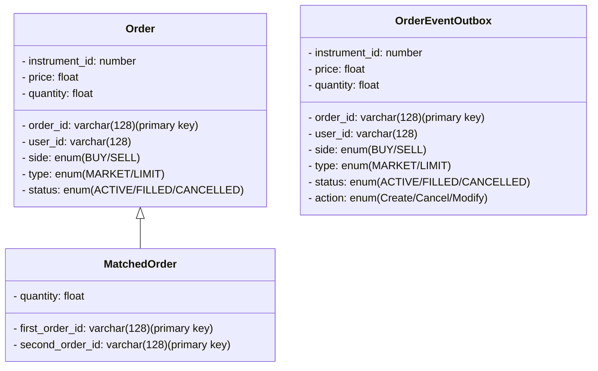
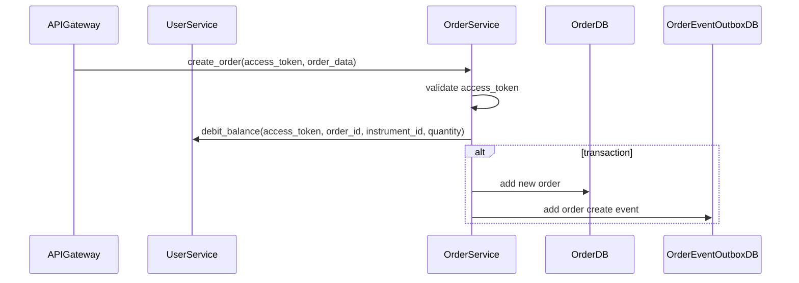

# API design
- POST /create_order(access_token (include user_id), instrument_id, price, quantity, side: Buy/Sell, type: Market/Limit) -> order_id
- POST /modify_order(access_token, order_id, instrument_id, price, quantity, side, type) -> err_code
- POST /cancel_order(access_token, order_id) -> err_code

- GET /list_order(access_token, status: Active/Filled/Cancelled, begin_time, end_time) -> [{order_id, instrument_id, price, ...}] 

# Database
## Order table (PostgreSQL)

# Sequence diagram
## Create Order

