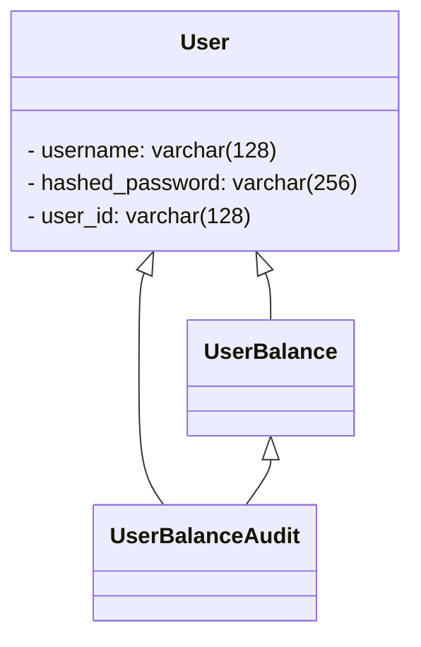
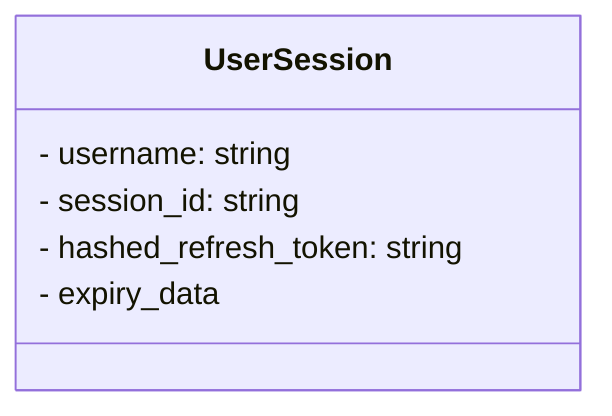
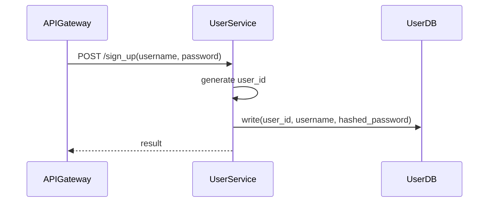
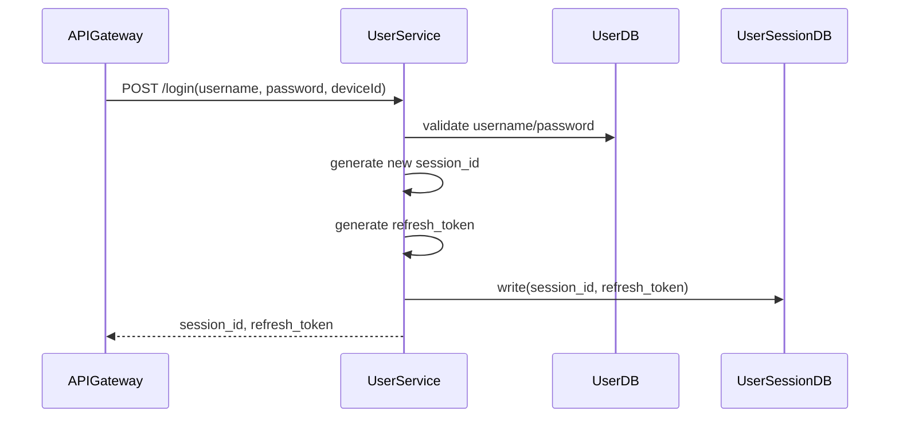
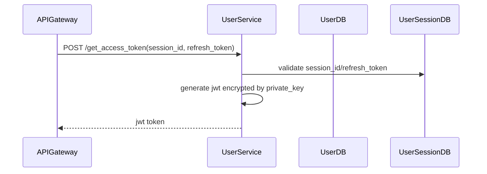
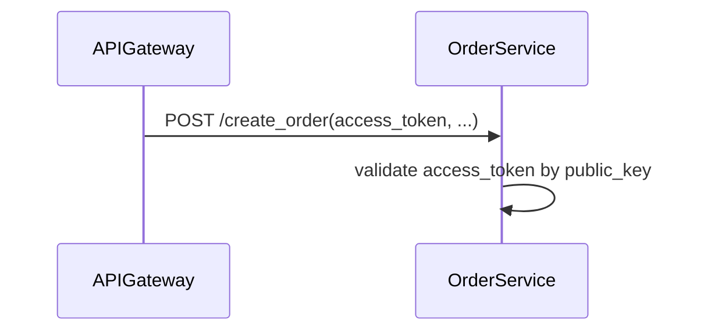
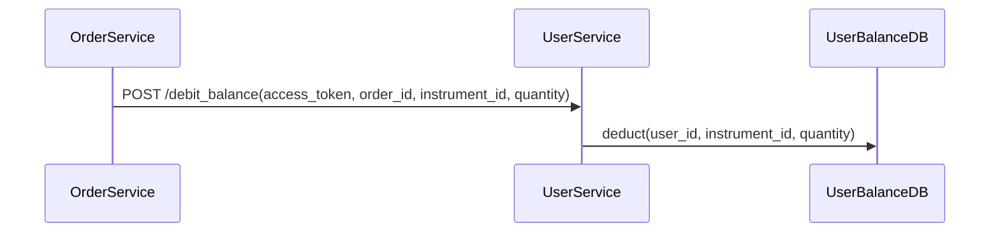

# API design
- POST /sign_up(username,password)
- POST /login(username,password) -> session_id, refresh_token
- POST /get_access_token(session_id, refresh_token)

- POST /debit_balance(access_token, order_id, instrument_id, quantity)

# Database
## User table (PostgreSQL)


## UserBalance table (TigerBeetles)
```mermaid
    class UserBalance {
        - ledger: instrument_id
        - user_id: string
        - balance: float
    }
```

## UserSession (Redis)


# Sequence diagram 
## Create Account

## Login flow


## GetAccessToken flow


## Validate access token flow


## Debit balance flow

NOTE: ignore Audit flow in the current phase
